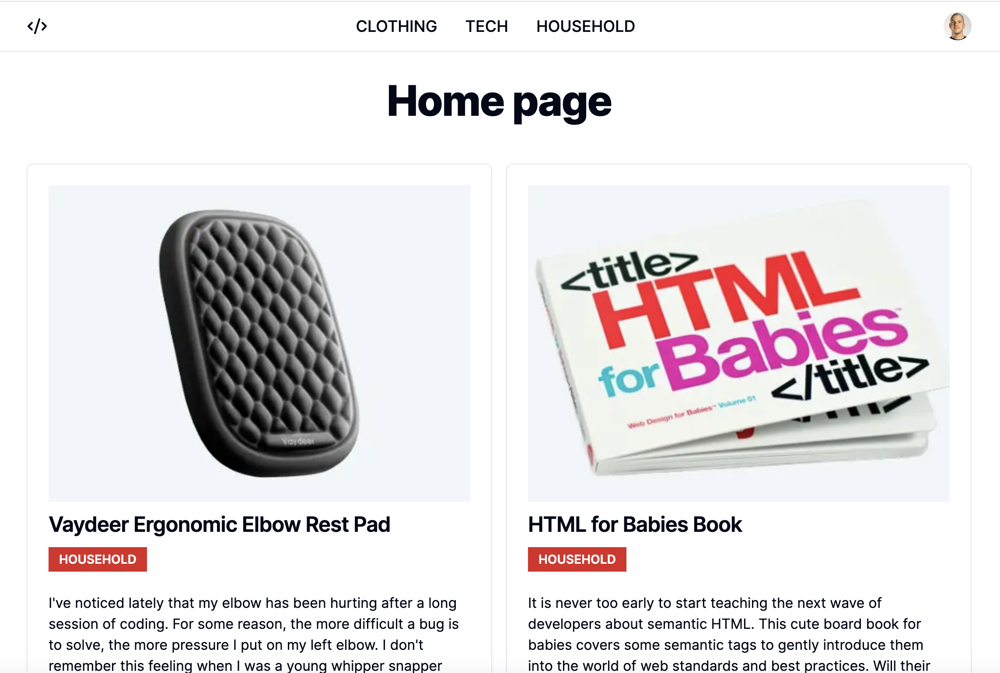

# Gifts for Programmers

A web application for posting curated lists to a niche audience.  There is a simple admin portion of the site that requires authentication and allows the admin to create, edit, and delete posts.


## Screenshots




## Demo

Visit [https://giftsforprogrammers.vercel.app/](https://giftsforprogrammers.vercel.app/) to see the live site.


## Tech Stack

**Client:**
  * React
  * Next.js
  * NextAuth
  * shadcn/ui
  * TailwindCSS

**Testing:**
  * Jest
  * React Testing Library
  * Cypress e2e

**Server:**
  * Next.js
  * PostgreSQL (Supabase)


## Features

- Light/dark mode based on system preferences
- Admin portal that allows creating, editing, and deleting posts
- Curated lists of gifts programmers may enjoy

## Environment Variables

To run this project, you will need to add the following environment variables to your .env file

`DATABASE_URL`


## Run Locally

Clone the project

```bash
  git clone https://github.com/chadchristensen/giftsforprogrammers.git
```

Go to the project directory

```bash
  cd giftsforprogrammers
```

Install dependencies

```bash
  npm install
```

Start the server

```bash
  npm run dev
```

## Running DB with Docker
There is a `docker-compose.yml` that will start up a PostgeSQL database.

You will need to have a `dp_password.secret.txt` file in your repo that contains the password to the database.

This file should be in included in the `.gitignore` file.

## Seeding the Database
This is a helper script to seed the database for initial setup for development.

To run the seed script, run the following command
```bash
  npm run seed
```
## Running Tests

To run tests, run the following command

```bash
  npm run test
```

or 

```bash
  npm run test:watch
```

## Roadmap

* Performance optimizations
  * I want to ensure I’m using Next.js to the fullest extent and employing the appropriate caching strategies
* Share functionality
  * I need to facilitate sharing posts in an easy way
* Expanded authentication
  * Currently, I'm the only one who can log in muahahaha
* Save post functionality
  * Don't need to be authenticated, use IndexedDB
* Database Migrations
* Open Graph meta tags
  * I need the posts to display in a visually appealing way when shared on social media
* Dark mode theme switcher
  * This is a site for developers after all
* Pagination
  * I didn’t need this for initial launch since I’m only launching with 4 posts, but I plan for the number of posts to grow steadily
* Branding
  * I need a custom domain name, and customize the styling of the site a bit more
